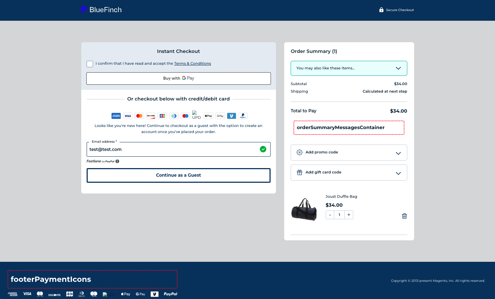
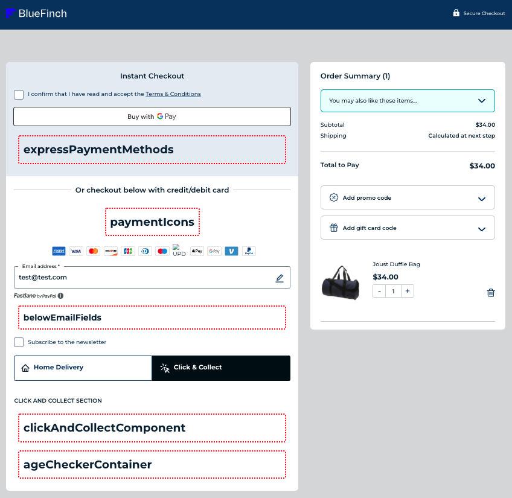
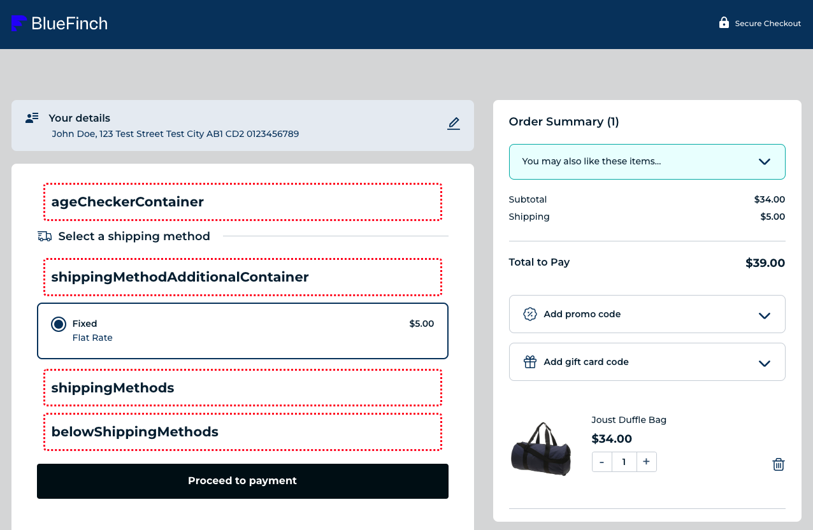
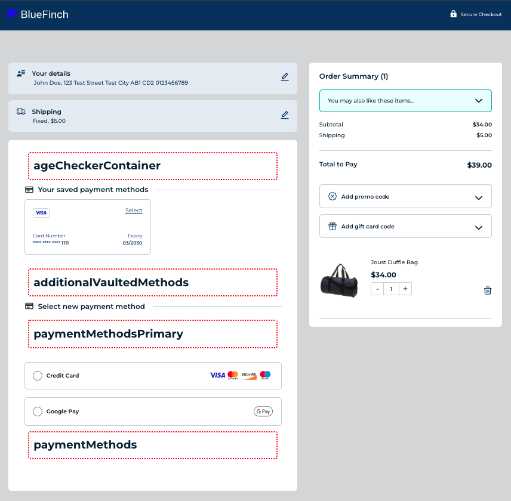

# BlueFinch Checkout - Custom Extension Guide

This guide covers how to extend the BlueFinch Checkout from within your own custom Magento modules, so that you can add new components, integrate additional functionality via event, functional or GraphQL query mutation callback functions or change the styling.

## How to extend BlueFinch Checkout functionality with a custom module
To use this functionality, the high level steps to follow are:

1. Create a new Magento 2 module as per [Magento standards](https://experienceleague.adobe.com/en/docs/commerce-learn/tutorials/backend-development/create-module).
1. Create a `view/frontend/templates` directory to add a .phtml template file for your module, in which you can declare custom callbacks, components, styles etc.
1. Create a `view/frontend/layouts` directory containing a `bluefinch_checkout_index.xml` XML layout file to include your modules .phtml template file in your stores BlueFinch Checkout page.
1. Create a `view/frontend/web/js/checkout/src/` directory containing your BlueFinch Checkout extension code.

## BlueFinch Checkout module template

**Please refer to our template for creating BlueFinch Checkout modules [here](https://github.com/BlueFinchCommerce/module-checkout-template)**, which has all the necssary files required, including those for building the front end assets.

## How to add a new component

### Set up a component file
1. Navigate to the `view/frontend/js/checkout/src` directory within your module.
1. Here, create your component file in the `components` directory.
1. Each new component file should have a unique name and relevant logic for your checkout modification.

### Component Extension Points

We use [Vue dynamic components](https://vuejs.org/guide/essentials/component-basics#dynamic-components) and the `<component>` element, to provide component extension points to render any component(s) you create in your custom module:

### Global

| Extension Point                 | Usage                                              |
| ------------------------------- | -------------------------------------------------- |
| orderSummaryMessagesContainer   | Insert a component after order summary total       |
| footerPaymentIcons              | Insert a component before the footer payment icons |
||



### Details Page

| Extension Point                 | Usage                                                                                              |
| ------------------------------- | -------------------------------------------------------------------------------------------------- |
| expressPaymentMethods           | Insert a component after the last express payment method e.g. An additional express payment method |
| paymentIcons                    | Insert a component before the payment method icons container e.g. Some welcome text                |
| belowEmailFields                | Insert a component after the email field                                                           |
| clickAndCollectComponent        | Insert a component after the click and collect section                                             |
| ageCheckerContainer             | Insert a component after the details section e.g. Age Checker                                      |
||



### Shipping Page

| Extension Point                   | Usage                                                                                                                          |
| --------------------------------- | ------------------------------------------------------------------------------------------------------------------------------ |
| ageCheckerContainer               | Insert a component before the shipping methods container e.g. age checker                                                      |
| shippingMethodAdditionalContainer | Insert a component before the first shipping method e.g. An additional shipping method that you want to be your primary method |
| shippingMethods                   | Insert a component after the last shipping method e.g. An additional shipping method                                           |
| belowShippingMethods              | Insert a component after the shipping methods container e.g. delivery instructions                                             |
||



### Payment Page

| Extension Point          | Usage                                                                                                                        |
| -------------------------| ---------------------------------------------------------------------------------------------------------------------------- |
| ageCheckerContainer      | Insert a component before the payment methods container e.g. age checker                                                     |
| additionalVaultedMethods | Insert a component after the last vaulted method e.g. An additional vaulted method                                           |
| paymentMethodsPrimary    | Insert a component before the first payment method e.g. An additional payment method that you want to be your primary method |
| paymentMethods           | Insert a component after the last payment method e.g. An additional payment method                                           |
||


Example of an extension point in BlueFinch Checkout:

```html
<component
    :is="additionalShippingMethod"
    v-for="additionalShippingMethod in additionalShippingMethods"
    :key="additionalShippingMethod"
/>
```

After you have selected the component extension point for your custom component, you need to register it in the modules .phtml file, via the global `window.bluefinchCheckout` namespace:

1. Add the global `window.bluefinchCheckout` namespace.
2. Add the component extension point namespace, to the global `window.bluefinchCheckout` namespace.
3. Add your components namespace to the extension points namespace, then set the value to the path of the compiled and minified component js file name in the `checkout/dist` directory.

Example:

```html
<script>
    window.bluefinchCheckout = window.bluefinchCheckout || {};
    window.bluefinchCheckout.belowShippingMethods = window.bluefinchCheckout.belowShippingMethods || {};

    window.bluefinchCheckout.belowShippingMethods.newComponent = "<?= $escaper->escapeJs($block->getViewFileUrl('ModuleNamespace_ModuleName::js/checkout/dist/components/NewComponent/NewComponent.min.js')) ?>";
</script>
```
To render your component locally, see [local workflow](../.github/CONTRIBUTING.md#local-workflow).

## How to create callback functions
Callback functions enable you to define custom responses to various checkout events.

You can choose from the available callback extension points listed below, to integrate your functionionality effectively:

### Event Extension Points

#### Global

| Event Extension Point | Parameters          | Usage |
| --------------------- | ------------------- | ----- |
| onCreate              | -                   | Occurs in the [root app's](../view/frontend/web/js/checkout/src/App.vue) `created` lifecycle hook on initial render of the app once the initial config is retreived and the initial step is set. |
| onStepsCreated        | -                   | Occurs in the [steps component](../view/frontend/web/js/checkout/src/components/Steps/Steps.vue) `created` lifecycle hook. |
| onLogin               | -                   | Occurs when a customer logs in using the [email address component](view/frontend/web/js/checkout/src/components/Steps/CustomerInfoPage/EmailAddress/EmailAddress.vue) triggering the login function in the [customer store](view/frontend/web/js/checkout/src/stores/CustomerStore.js). |
| onHandleCartData      | [cart, configStore] | Occurs in `handleCartData` action in the [customer store](../view/frontend/web/js/checkout/src/stores/CustomerStore.js), which updates the correct stores with cart data. |
||

#### Details Page

| Event Extension Point  | Parameters | Usage |
| ---------------------- | ---------- | ----- |
| onBraintreeExpressInit | -          | Occurs in each of the Braintree express payment components ([Apple Pay](../view/frontend/web/js/checkout/src/components/Steps/PaymentPage/Braintree/ApplePay/ApplePay.vue), [Google Pay](../module-checkout/view/frontend/web/js/checkout/src/components/Steps/PaymentPage/Braintree/GooglePay/GooglePay.vue) and [PayPal](../module-checkout/view/frontend/web/js/checkout/src/components/Steps/PaymentPage/Braintree/PayPal/PayPal.vue)), once the options button has been clicked and the express payment method is initiated.  |
| onUserProceed          |[email]     | Occurs when a customer clicks the button to proceed from the email address section to the delivery address section, in the [email address component](view/frontend/web/js/checkout/src/components/Steps/CustomerInfoPage/EmailAddress/EmailAddress.vue). |
| onDeliveryTabEvent     | -          | Occurs every time a customer clicks the home delivery tab element in the delivery section of the [details step component](..view/frontend/web/js/checkout/src/components/Steps/CustomerInfoPage/DetailsPage/DetailsPage.vue). |
| onEditAddress          | -          | Occurs every time a customer clicks the edit icon for the delivery address in the delivery section of the [details step component](..view/frontend/web/js/checkout/src/components/Steps/CustomerInfoPage/DetailsPage/DetailsPage.vue). |
||

#### Shipping Page

| Event Extension Point          | Parameters | Usage |
| -------------------------------| ---------- | ----- |
| onSetShippingStep              | -          | Occurs whenever a customer navigates to the shipping step and is triggered in the `goToShipping` function the [steps store](../goToShipping). |
| onShippingMethodMounted        | -          | Occurs in the `created` lifecycle hook of the [shipping step component](../view/frontend/web/js/checkout/src/components/Steps/ShippingPage/ShippingPage.vue), after the intitial configuration and cart data are fetched, before the default shipping method is set. |
| onSubmitShippingOptionAgeCheck | -          | Occurs when a customer proceeds from the details step to the shipping step, triggered in the `submitShippingOption` method of the [details step component](..view/frontend/web/js/checkout/src/components/Steps/CustomerInfoPage/DetailsPage/DetailsPage.vue). |
||

#### Payment Page

| Event Extension Point | Parameters | Usage |
| ----------------------| ---------- | ----- |
| onPaymentDataChanged  | -          | Occurs in the `onPaymentDataChanged` method of the Braintree [Google pay component](view/frontend/web/js/checkout/src/components/Steps/PaymentPage/Braintree/GooglePay/GooglePay.vue). |
||

### GraphQL Query Mutations

Callback function extensions for GraphQL requests, provide the GraphQL query as a string before the data is fetched, so that you can amend and return this query in your custom modules callback function(s), to change the request.

| GraphQL Extension Point | Parameters | Usage |
| ------------------------| ---------- | ----- |
| getAppliedCoupons       | [appliedCoupons] | Partial GraphQL query string for applied coupons. |
| getBillingAddress       | [billingAddress] | Partial GraphQL query string for customers billing address. |
| getFullCart             | [fullCart] | Partial GraphQL query string for customers full cart. |
| getGiftCards            | [giftCards] | Partial GraphQL query string for applied gift cards. |
| getGiftWrapping         | [giftWrapping] | Partial GraphQL query string for gift wrapping. |
| geIsVirtual             | [isVirtual] | Partial GraphQL query string for is item virtual. |
| getItems                | [items] | Partial GraphQL query string for cart items. |
| getPaymentMethods       | [paymentMethods] | Partial GraphQL query string for available payment methods. |
| getPrices               | [getPrices] | Partial GraphQL query string for prices. |
| getRewardPoints         | [rewardPoints] | Partial GraphQL quer string for applied reward points. |
| getShippingAddresses    | [shippingAddresses] | Partial GraphQL query string for customers shipping addresses. |
| getStoreCredit          | [storeCredit] | Partial GraphQL query string for applied store credit. |
||

### Miscellaneous Function Extension Points

| Extension Point     | Parameters | Usage |
| --------------------| ---------- | ----- |
| getCrossSellsHeader | [titleText, showIcon] | Cross sells title text, boolean to show the cross sells promo icon in the cross sells header section. |
| getShippingMethods  | [cart, paymentMethod, express] | Occurs after the GraphQL request to get the shipping method on the cart and allows the cart data to be modified and returned. |
||

### Add your code:

After you have selected the function extension point for your custom component, you need to create a callback file in your modules `view/frontend/js/checkout/src/callbacks` directory.

BlueFinch Checkout exports it's components, helpers, router, services and stores, so you can load any of these in for use in your custom module using:

`view/frontend/web/js/checkout/src/helpers/extensionData/loadFromCheckout.js`

Please refer to the `index.js` in each of their respective directories under `src` to see what is available.

You then you can register your callback in the modules .phtml file, via the global `window.bluefinchCheckout` namespace:

1. Add the global `window.bluefinchCheckout` namespace.
1. Add the `callbacks` namespace to the `window.bluefinchCheckout` namespace.
1. Add the function extension point namespace, to the global `window.bluefinchCheckout` namespace.
1. Add your components namespace to the extension points namespace, then set the value to the path of the compiled and minified component js file name in the `checkout/dist` directory.

Example:

```html
<script>
    window.bluefinchCheckout = window.bluefinchCheckout || {};
    window.bluefinchCheckout.callbacks = window.bluefinchCheckout.callbacks || {};
    window.bluefinchCheckout.callbacks.onLogin = window.bluefinchCheckout.callbacks.onLogin || {};

    window.bluefinchCheckout.callbacks.onLogin.newModuleOnLogin = "<?= $escaper->escapeJs($block->getViewFileUrl('ModuleNamespace_ModuleName::js/checkout/dist/callbacks/onLogin.min.js')) ?>";
</script>
```

To test your function extension on the front end, see [local workflow](../.github/CONTRIBUTING.md#local-workflow).

## How to change styling

For adding styles to your **component**, you can:
1. Create a new component scss file in `view/frontend/web/js/checkout/src/components/newComponent/newComponent.scss` with your required styles. **We recommend that the name of your scss file(s) should be unique within your module.** This helps to avoid any build time compilation issues, when you have the need for multiple components, each with it's own scss file.
1. Register it in the modules .phtml using a html link element, for example `<link rel="stylesheet" href="<?= $escaper->escapeHtmlAttr($block->getViewFileUrl('ModuleNamespace_ModuleName::js/checkout/dist/newComponent.css')) ?>" />`
1. Build your code, see [local workflow](../.github/CONTRIBUTING.md#local-workflow)

You also have two other options for changing styles:
1. We provide an Admin designer where you change variables for colours/font/text via configuration.
1. Log into the Magento admin area, then: Stores > Configuration (Select your store if multi store) > BlueFinch > Checkout > General > Checkout Designer
1. Click on the `Open Designer` button and you can change these values in our interactive preview.
1. Amend the styles following the standard Magento process in your custom theme by creating a `web/css/checkout.less` and and overriding the variables and/or styles from the BlueFinch Checkout theme and admin designer settings. Example:

```
:root.vue-checkout-active #bluefinch-checkout-root {
    // Fonts
    --font-weight__semibold: 600;
    --font-weight__bold: 700;
}
```

## Remove checkout styles from your theme

We recommend that you remove any unused Magento Checkout styles within your custom theme, that are not BlueFinch Checkout related, so they are not generated in the CSS for the rest of your site.
